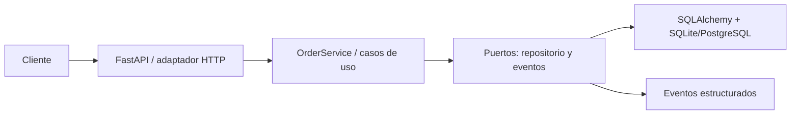
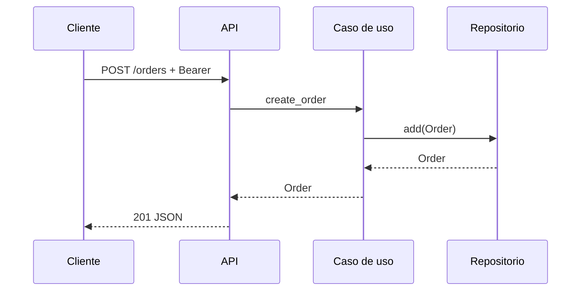

# Arquitectura

Las dependencias apuntan hacia dentro: `domain` no importa infraestructura; `application` sólo conoce protocolos. Los adaptadores se inyectan desde `api.py`.

## Secuencia de creación

